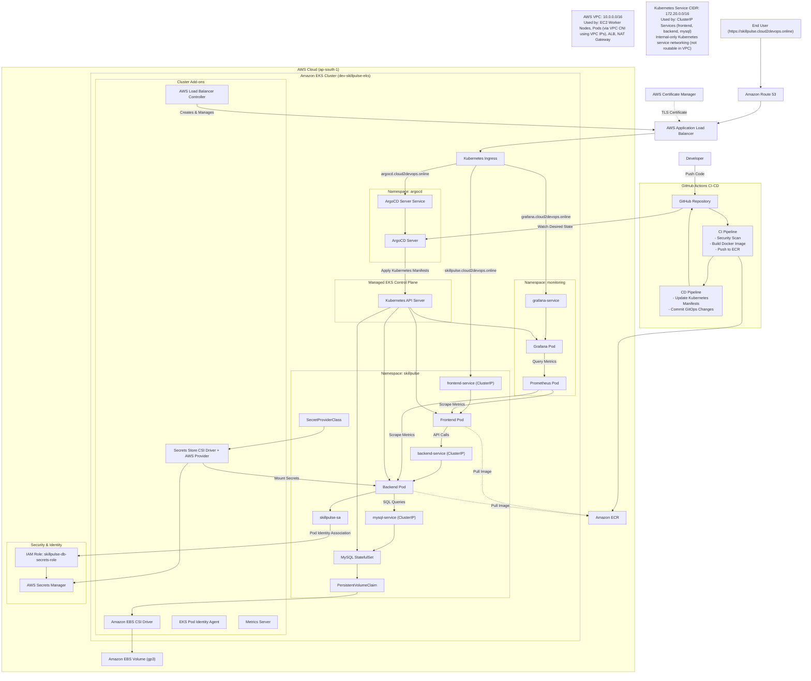

# SkillPulse — GitOps-Based Three-Tier Application on Amazon EKS


---

## Project Overview

SkillPulse is a three-tier web application that allows users to track the skills they are learning and the time invested in each skill. The application layer is intentionally lightweight, consisting of a Go backend API, a vanilla JavaScript frontend served via Nginx, and a MySQL database.

The primary value of this repository lies in the platform engineering layer built around the application. It focuses on secure infrastructure provisioning, GitOps-based delivery, automated security enforcement, secret management, and fully automated cloud-native deployments on Kubernetes.

---

## What Already Existed

This project is forked from `LondheShubham153/github-actions-kubernetes-masterclass`, which provided the initial application baseline and a simple deployment approach.

It included:

- Dockerfile for the Go backend service
- Dockerfile for the Nginx frontend service
- docker-compose.yml for local three-tier development
- A basic CI/CD pipeline that deployed the application via SSH and executed `docker compose up` on every push to `main`

---

## Enhancements

This repository **significantly extends and redesigns** that baseline application into a production-oriented Kubernetes platform by implementing:

- Terraform-based AWS infrastructure provisioning
- Amazon EKS cluster automation
- GitHub OIDC authentication with AWS IAM
- GitOps deployments using ArgoCD
- Kubernetes-native deployment architecture
- AWS Secrets Manager integration via CSI Driver and ASCP
- EBS CSI dynamic persistent storage provisioning
- Horizontal Pod Autoscaling
- AWS Load Balancer Controller ingress management
- Route53 + ACM TLS integration
- Centralized monitoring stack deployment
- Security scanning pipelines using:
  - Gitleaks
  - Hadolint
  - Govulncheck
  - Trivy
- Immutable image versioning using Git commit SHAs
- Fully automated CI/CD workflows using GitHub Actions

The result is a **complete cloud-native deployment platform** that reflects modern DevOps and GitOps operational practices rather than a simple containerized application deployment.

---

## SkillPulse Architecture



---

## GitOps Deployment Model

This project follows GitOps principles using ArgoCD.

**Deployment flow:**

```text
GitHub Actions builds container images
            ↓
Images pushed to Amazon ECR
            ↓
CD workflow updates Kubernetes manifests
            ↓
ArgoCD detects repository changes
            ↓
Kubernetes workloads automatically reconcile
```

This provides:

- Declarative deployments
- Auditability
- Rollback capability
- Immutable release tracking
- Automated synchronization

---

## Tech Stack

| Category | Technology |
|---|---|
| Cloud Provider | AWS |
| Container Orchestration | Amazon EKS |
| Infrastructure as Code | Terraform |
| GitOps | ArgoCD |
| CI/CD | GitHub Actions |
| Container Registry | Amazon ECR |
| Backend | Go |
| Frontend | Nginx + JavaScript |
| Database | MySQL |
| Ingress | AWS Load Balancer Controller |
| Secrets Management | AWS Secrets Manager |
| Kubernetes Secrets Integration | Secrets Store CSI + ASCP |
| Persistent Storage | Amazon EBS CSI Driver |
| Monitoring | Prometheus + Grafana |
| DNS | Route53 |
| TLS Certificates | AWS ACM |
| Security Scanning | Trivy, Gitleaks, Hadolint, Govulncheck |

---

## Features

- GitOps-based Kubernetes deployments
- Terraform-managed AWS infrastructure
- Secure GitHub OIDC authentication
- Amazon EKS cluster provisioning
- AWS-native ingress with ALB
- Route53 DNS integration
- ACM-managed HTTPS/TLS
- Kubernetes Horizontal Pod Autoscaling
- Dynamic EBS persistent storage provisioning
- Secrets Manager integration using CSI Driver
- Immutable Docker image deployments
- Automated GitHub Actions CI/CD pipelines
- Security scanning integrated into CI
- ArgoCD automated reconciliation
- Monitoring stack deployment with Grafana & Prometheus
- Production-style Kubernetes manifest orchestration using ArgoCD sync waves

---

## Security Highlights

- GitHub OIDC federation with AWS IAM
- No long-lived AWS credentials stored in GitHub
- Secrets stored securely in AWS Secrets Manager
- Pod-level IAM access using EKS Pod Identity
- Vulnerability scanning integrated into CI pipeline
- HTTPS enforced using ACM certificates
- Kubernetes readiness, liveness, and startup probes
- Immutable image deployments using commit SHAs

---

## Monitoring Stack

The cluster includes:

- **Prometheus** — Metrics collection and alerting
- **Grafana** — Visualization dashboards
- **Kubernetes Metrics Server** — Resource utilization metrics

Monitoring dashboards are exposed securely through AWS ALB Ingress with HTTPS enabled using ACM certificates.

---

## Application, ArgoCD & Grafana Endpoints

| Service | URL |
|---|---|
| SkillPulse Application | https://skillpulse.cloud2devops.online |
| ArgoCD Dashboard | https://argocd.cloud2devops.online |
| Grafana Dashboard | https://grafana.cloud2devops.online |

---

## Getting Started

Follow the documentation in this order to set up the complete platform:

1. **[prerequisites.md](prerequisites.md)** — Configure AWS OIDC, GitHub Secrets, Route53, ACM, ECR, S3, and Secrets Manager.
2. **[infra.md](infra.md)** — Provision VPC and EKS cluster using Terraform.
3. **[deployment.md](deployment.md)** — Connect to EKS, verify add-ons, deploy ingress, configure IAM, and deploy the application via ArgoCD.
4. **[github-actions.md](github-actions.md)** — Understand the CI/CD pipeline for automated builds and deployments.

---

## Documentation

| Document | Description |
|---|---|
| [prerequisites.md](prerequisites.md) | AWS, GitHub, Route53, ACM, and ECR setup |
| [infra.md](infra.md) | Terraform infrastructure provisioning |
| [deployment.md](deployment.md) | Application deployment and post-deployment steps |
| [github-actions.md](github-actions.md) | CI/CD pipeline explanation |
